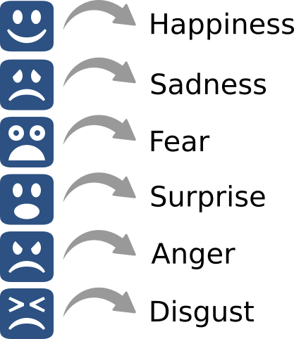
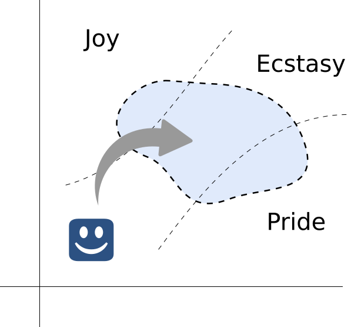
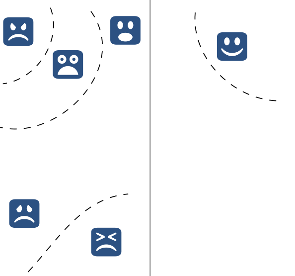

### Introduction
# Universality and emotions

The issue of the *universality of facial expressions* is one of the most debated experimental problems in emotion science.

<!-- .element: class="fragment"-->

> Probably since Ekman and Friesen it is widely taught that there are a number of *cross-culturally produced and recognized* expressions.

<!-- .element: class="fragment"-->

Debates in emotion theory discuss universality and the controversies surrounding it. <!-- .element: class="fragment"-->

> Example: BET vs. Constructionism.
<!-- .element: class="fragment"-->

---

### Introduction
# Claims

**Main claim**: Universality of emotional expression does not decide on some crucial issues in emotion theory.

<!-- .element: class="fragment"-->

* Discreteness vs. Dimensionality <!-- .element: class="fragment"-->

* Emotion taxonomy <!-- .element: class="fragment"-->

Consequently, universality is best kept separate from issues regarding what emotions are. <!-- .element: class="fragment"-->

---
### Introduction
# Outline

1. Understanding universality <!-- .element: class="fragment"-->
2. Consequences of universality <!-- .element: class="fragment"-->
3. Excursus: Controversies <!-- .element: class="fragment"-->
4. Specificity of expression <!-- .element: class="fragment"-->
5. Attribution of expression <!-- .element: class="fragment"-->
6. Conclusions and recommendations <!-- .element: class="fragment"-->

---section---

### Understanding universality
# Russell's Universality Thesis

Russell (1994) analyzes the _Universality Thesis_ in terms of four related but distinct propositions:

1. Universality of facial movements <!-- .element: class="fragment"-->
2. Expressiveness of facial movements <!-- .element: class="fragment"-->
3. Universality of attribution <!-- .element: class="fragment"-->
4. Correctness of attribution  <!-- .element: class="fragment"-->

**References:**

Russell, J. A. (1994). Is There Universal Recognition of Emotion From Facial Expression? A Review of the Cross-Cultural Studies. _Psychological Bulletin_, 115(1), 102–141.

---
### Russell's Universality Thesis
---
1. Universality of facial movements.
  > "[...] specific patterns of facial muscle movement occur in all human beings [...]" <!-- .element: class="fragment"-->

**Example:** Ekman's basic emotions

<!-- .element: class="fragment"-->

 <!-- .element: class="fragment"-->

---
### Russell's Universality Thesis
---

2. Expressiveness of facial movements. <!-- .element: class="fragment"-->
  > "[...] certain facial patterns are manifestation of the same emotions in all human beings [...]"

Every pattern of expression corresponds to an emotion and does so in all humans. <!-- .element: class="fragment"-->

 <!-- .element: style="height: 100%" class="fragment"-->

---
### Russell's Universality Thesis
---
3. Universality of attribution.
  > "[...] observers everywhere attribute the same emotional meaning to those facial patterns [...]"
  <!-- .element: class="fragment"-->

4. Correctness of attribution
  > "[...] observers are correct in the emotions they (consensually) attribute to those facial patterns."
    <!-- .element: class="fragment"-->

---
### Russell's Universality Thesis
# Logical relations
---
Russell thinks that _correctness_ presupposes all other three.

> False. There may not be specific patterns across cultures and yet people may be right whenever they see an expression. <!-- .element: class="fragment"-->

> Only presupposes 3, i.e., that people attribute universally. <!-- .element: class="fragment"-->

> It is unlikely is 1 and 2 are false. <!-- .element: class="fragment"-->

---
### Logical relations
---
Claims 1-3 are descriptive. 4 is normative.

> 1 through 3 describe possible states of affairs (to be tested empirically). <!-- .element: class="fragment"-->

> 4 also presupposes some descriptive statement (i.e., 3), but goes beyond in saying that are successful in attributing emotions. <!-- .element: class="fragment"-->

> Requires some norm as to what counts as _successful_.

<!-- .element: class="fragment"-->

---
### Logical relations
---
Claims 1 and 2 concern _specificity_. Claims 3 and 4 concern _attribution_.

> Claims 1 and 2 are claims about the _existence of patterns_ and the _correspondence_ between those patterns and emotions.

<!-- .element: class="fragment"-->

> Claims 3 and 4 are claims about how others _interpret_ those expressions.

<!-- .element: class="fragment"-->

---
### Understanding universality
# Defining universality

Universality Thesis (UT):
> There is a set of patterns of facial muscle movement that (1) _occur in all human beings_, that (2) _correspond_ to specific emotion patterns, and (3) to which people across cultures _attribute the same meaning_ (4) _successfully_.

Two subclaims:
> **Specificity** (**UT-S**): There is a set of patterns of facial muscle movement that (1) _occur in all human beings_, that (2) _correspond_ to specific emotion patterns.

<!-- .element: class="fragment"-->

> **Attribution** (**UT-A**): People across cultures (3)  _attribute the same emotional meaning_ to the same expressions and (4) do so _successfully_.

<!-- .element: class="fragment"-->

---section---

### Consequences of universality
# What does universality entail?

Universality → (Neuro)physiological specificity

> "A focus on universals in expression was *inconsistent* with the then-reigning [as of the 1960s] view that all that differentiates one emotion from another is our expectations about what we should be feeling. [...] once expressions were found to be emotion specific, it made sense to reexamine the issue of whether there might also be emotion-specific *physiological* changes." (Ekman, 1993, p. 385; my emphasis)

<!-- .element: class="fragment"-->

**References:**

Ekman, P. (1993). Facial expression and emotion. _American Psychologist, 48_(4), 376–379.

---

Likewise, skeptics about specificity claims have attacked findings presumably supporting universality claims.

> The classical view hypothesizes that the pattern of ANS changes is highly similar across instances of the same emotion category, reflecting some central emotional state. [...] This pattern is hypothesized to be consistent across contexts and individuals regardless of age and culture. An ANS pattern should be specific to one (and only one) emotion category. [...]  There is a general consensus within the classical view that “anger,” “disgust,” “fear,” “happiness,” and “sadness” qualify as “basic” categories meaning they have a biological fingerprint and are *universally expressed and recognized*. (Siegel et al., 2018, pp. 345-346; my emphasis)

<!-- .element: class="fragment"-->

**References:**

Siegel, E. H., Sands, M. K., Van den Noortgate, W., Condon, P., Chang, Y., Dy, J., Quigley, K. S., & Barrett, L. F. (2018). Emotion fingerprints or emotion populations? A meta-analytic investigation of autonomic features of emotion categories. _Psychological Bulletin, 144_(4), 343–393.

---
### Consequences of universality
---
Ekman believes that universality establishes discreteness:

> "The research on facial expressions has also shown the utility of conceiving of emotions as *separate discrete states*, such as fear, anger, and disgust, rather than simply as positive versus negative states or even more simply as differing only in respect to arousal." (1993, p. 386)

<!-- .element: class="fragment"-->

Correspondence between expression and patterns of (neuro)physiological activity → One-to-one correspondence between emotions and discrete patterns of autonomic activity. <!-- .element: class="fragment"-->

**References:**

Ekman, P. (1993). Facial expression and emotion. _American Psychologist, 48_(4), 376–379.

---
### Consequences of universality
---
Additionally, Ekman thinks that findings concerning universality can also determine the number of existing emotions.

> "If our definition of emotion were to require a distinctive expression so that conspecifics can know instantly from a glance how a person is feeling, then we need look only to the evidence on how many emotions have distinctive expressions to determine the number of emotions." (Ekman, 1993, pp. 386-387) <!-- .element: class="fragment"-->

**References:**

Ekman, P. (1993). Facial expression and emotion. _American Psychologist, 48_(4), 376–379.

---

This inference is neither deductive nor is it so simple.

> [It is not true that] most BET researchers hold the simplistic view that evidence of universality *necessarily implies* evolution by natural selection, instead acknowledging that evidence of cross-cultural similarity might also be explained by cultural processes common to cultures around the world [...].

<!-- .element: class="fragment"-->

> Instead, the study of emotional expression has moved away from such Manichean distinctions---expression is either shaped by evolution or culturally constructed---to systematic approaches to understanding how both classes of processes shape emotional expression in compelling ways. (Keltner, et al., 2019, p. 199) <!-- .element: class="fragment"-->

**References:**

Keltner, D., Tracy, J. L., Sauter, D., & Cowen, A. (2019). What Basic Emotion Theory Really Says for the Twenty-First Century Study of Emotion. _Journal of Nonverbal Behavior, 43_(2), 195–201.

---

Yet, I want to make clear two important points that deserve to be made explicit in the literature.

1. Universality does not establish discreteness. <!-- .element: class="fragment"-->
2. Universality does not establish a taxonomy of emotions. <!-- .element: class="fragment"-->

This heuristic has been useful in putting forward interesting hypotheses in emotion science. Yet, I think it is time to re-evaluate this inference. <!-- .element: class="fragment"-->

---section---

### Criticisms of universality
# Why resist universality?

Most criticism of universality yet has been *methodological*.

* Russell (1994) <!-- .element: class="fragment"-->
* Nelson & Russell (2013) <!-- .element: class="fragment"-->
* Gendron, et al. (2018) <!-- .element: class="fragment"-->

Methodological criticism: Data was not gathered in the best way. <!-- .element: class="fragment"-->

**References:**

Russell, J. A. (1994). Is There Universal Recognition of Emotion From Facial Expression? A Review of the Cross-Cultural Studies. _Psychological Bulletin_, 115(1), 102–141.

Nelson, N. L., & Russell, J. A. (2013). Universality Revisited. _Emotion Review_, 5(1), 8–15.

Gendron, M., Crivelli, C., & Barrett, L. F. (2018). Universality Reconsidered: Diversity in Making Meaning of Facial Expressions. _Current Directions in Psychological Science_, 27(4), 211–219.

---
### Criticisms of universality
# Methodological criticism

Following Gendron, et al. (2018):

* Use of researcher-provided words <!-- .element: class="fragment"-->
* Task features (artificially) increase agreement <!-- .element: class="fragment"-->
* Information may leak from instructions <!-- .element: class="fragment"-->
* Other methods provide conflicting evidence. <!-- .element: class="fragment"-->

**References:**

Gendron, M., Crivelli, C., & Barrett, L. F. (2018). Universality Reconsidered: Diversity in Making Meaning of Facial Expressions. _Current Directions in Psychological Science_, 27(4), 211–219.

---
### Criticisms of universality
# Methodology vs. Theory

Methodological concerns are (mostly) correct, but besides the issue.

Strategy:

> Even if evidence was obtained under ideal conditions and methods, what would it show?

Working hypothesis:

> Evidence would not show what many take it to show.

---section---

### Consequences of universality revisited
# Specificity of expression to discreteness

  

  The existence of specific expressive patterns does not entail that emotion categories are discrete.

  > **Example**: Smiling may be specific and universal, yet correspond to dimensionally individuated states of positive emotions.

  <!-- .element: class="fragment"-->

  

  

  

  

---
### Specificity to discreteness
---
UT-S is compatible with dimensional theories.

* Dimensional appraisal theories (Scherer, Moors)
  > Expressive components may be specific and universal, yet correspond to different combinations of other components.

<!-- .element: class="fragment"-->

* Psychological Constructionism (Russell, Barrett)
  > Emotions are individuated in context, hence a given expression may correspond to different emotions contextually.

<!-- .element: class="fragment"-->

---
### Specificity to discreteness
---

In general, specific expressions may be related to areas in a dimensional space.

These areas need not correspond to discrete emotions nor does correspondence need to be one-to-one. <!-- .element: class="fragment"-->

---
### Specificity to discreteness
---
**Question:** If specificity is true but discreteness is not, why is UT-S true?

* Universality claims suggest evolutionary mechanisms in order to explain cross-culturality.

<!-- .element: class="fragment"-->

* Evolutionarily expressions would have *signal value*.

<!-- .element: class="fragment"-->

**Reply:** Expressions may have signal value even just by signaling more general areas in affective space than discrete emotions.

<!-- .element: class="fragment"-->

---
### Consequences of universality revisited
# Specificity of expression to taxonomy
Specificity of expression could suggest some way of organizing emotions.

Even if emotions correspond to areas in affective space, UT-S may establish ways of categorizing. <!-- .element: class="fragment"-->

  * Behavioral criteria for folk conceptual construction. <!-- .element: class="fragment"-->

  * Behavioral components of scientific conceptual construction. <!-- .element: class="fragment"-->

---

### Specificity of expression to taxonomy
---

UT-S is not *necessary* for a concrete taxonomy.

* Neural, physiological, and behavioral specificity can occur without UT-S.

UT-S is not *sufficient* for a concrete taxonomy.

* Specificity of expression can occur without other forms of specificity.

* Example: Correspondence of one expression to more than one (neuro)physiological or behavioral pattern.

Correspondence with a specific pattern of expression seems *weak* evidence for specificity at other levels.

<!-- .element: class="fragment"-->

**See also:**

Loaiza, J. R. (2020). Emotions and the problem of variability. _Review of Philosophy and Psychology._

---
### Consequences of universality revisited
# Attribution claims
Concerning UT-A, the fact that people attribute a specific meaning to emotional expressions is only informative under some understanding of that *meaning*.

<!-- .element: class="fragment"-->

What do expressions *mean*? Two possibilities:

<!-- .element: class="fragment"-->

(1) Expressions signal concrete emotional (internal) states.

(2) Expressions signal more than concrete emotional (internal) states.

---
### Attribution claims
# Alt. 1: Internalism

Expressions signal concrete emotional (internal) states.

  * Compatible with both discreteness and dimensional views. <!-- .element: class="fragment"-->

  > The emotion expressed may be discrete or an area in affective space. <!-- .element: class="fragment"-->

  * Requires previous criteria for individuation. <!-- .element: class="fragment"-->

  > How can we individuate whatever an expression expresses? <!-- .element: class="fragment"-->

---
### Attribution claims
# Externalism

Expressions signal more than concrete (internal) states.

  * Suggests taxonomy should take *external* factors into account.

<!-- .element: class="fragment"-->

  * Compatible with some dimensional (e.g. Moors, 2017) and discrete (e.g. Eickers et al., 2017) views.

  <!-- .element: class="fragment"-->

  * Depends on which external factors we take into consideration. <!-- .element: class="fragment"-->

**References:**

Moors, A. (2017). Integration of Two Skeptical Emotion Theories: Dimensional Appraisal Theory and Russell’s Psychological Construction Theory. _Psychological Inquiry, 28_(1), 1–19. 

Eickers, G., Loaiza, J. R., & Prinz, J. (2017). Embodiment, Context-Sensitivity, and Discrete Emotions: A Response to Moors. _Psychological Inquiry, 28_(1), 31–38.

---section---

### Conclusions
# What does universality tell us about emotion?

Universality claims do not establish neither of two questions:

* Discreteness vs. Dimensionality <!-- .element: class="fragment"-->

* Deciding the taxonomy of emotions <!-- .element: class="fragment"-->

Traditional debates using universality as crucial seem misguided. <!-- .element: class="fragment"-->

---

### Conclusions
# What does universality tell us about emotion?

The existence of *specific* universal expressions is compatible with discrete and dimensional views.

<!-- .element: class="fragment"-->

> Expressions may correspond to either discrete patterns or areas in affective space. <!-- .element: class="fragment"-->

Specificity of expression cannot decide for a specific taxonomy. <!-- .element: class="fragment"-->

> Specificity of expression is weaker than other forms of specificity. <!-- .element: class="fragment"-->

---

### What does universality tell us about emotion?
# Some positive news

But what does it tell us then?

* Universality is interesting on its own. <!-- .element: class="fragment"-->

* Suggests evolutionary explanations. <!-- .element: class="fragment"-->

* Might inform internalism vs. externalism questions. <!-- .element: class="fragment"-->

---

### What does universality tell us about emotion?
# Recommendations

Universality is interesting on its own right, but might have been overstated in debates on the *nature of emotion*.

<!-- .element: class="fragment"-->

> Example: BET vs. Constructionism <!-- .element: class="fragment"-->

Universality might suggest an evolutionary account, but that is compatible with a number of views on categorization and taxonomy. <!-- .element: class="fragment"-->

Questions about universality may be best kept separate from questions about what emotions are. <!-- .element: class="fragment"-->

---

# Thank you!
